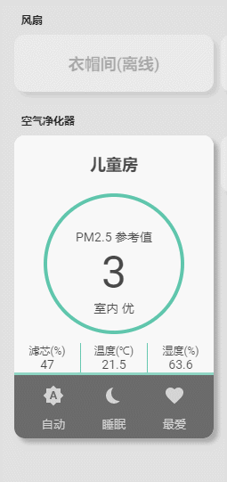

# 米家新风机的HASS卡片


```
// 引入
resources:
  - type: js
    url: /community_plugin/lovelace-air-fresh/air-fresh.js


// 使用面板卡
type: 'custom:air-fresh'
entity: fan.xiaomi_miio_device


// 使用面板卡（自定义背景图片）
// background-image 设置图片地址
// background-size 设置图片显示模式（别改）
// background-position 设置图片偏移量（x轴 y轴）

type: 'custom:air-fresh'
entity: fan.xiaomi_miio_device
style: >-
  .air-fresh-panel{
    background-image: url(https://c1.mifile.cn/f/i/16/chain/air2s/mj-mtair2s-atlas-04.jpg);
    background-size: cover;
    background-position: -10px 0;
  }

```



## 更新
+ 修复了卡片冲突的问题
+ 优化了显示效果
